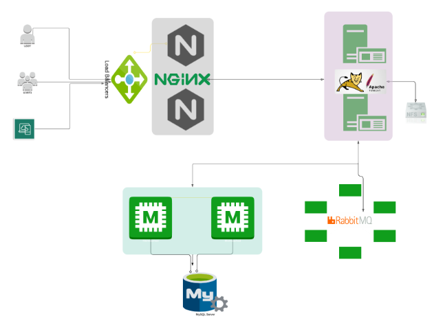

## JavaStack
### Automated Setup of A Multi Tier Web App

# Prerequisite

To complete this project you should have your lab set-up with the appropriate tools.

 - Git, Bash or any Code editor of choice
 - Oracle VirtualBox
 - Install Vagrant, and Vagrant Plugins.
 
# Project Architecture

This is a follow up project on the project: Multi Tier Web Application Stack Setup Locally but this time we will be automating 
the entire process with bash scripts and vagrant to bring up our VMs and provision the services with just one command.

Write your own bash script or inspect the script as contained in the project repo and explained in detail below. 
The Order of execution are also detailed in the vagrantfile

# Main command Vagrant 

Change directory to the automation_provisioning directory. 

hen run the vagrant up command
   
    vagrant up

To stop the Stack, run the command on your terminal in the working directory where the vagrantfile is located

    vagrant halt

To check status of the VMs , run the command

    vagrant status

To re-start the VMs again, run the command

    vagrant up

Finally to destroy the VMs, run the command

    vagrant destroy

To update configuration of an already running VM

    vagrant provision 'name-VM'

# Create folder scripts for bash file for 5VMs

# Bash Script for Nginx

Again, create a file named `nginx.sh` for the `frontend`. The bash script will provision nginx service which serves both as our web 
frontend interface and load balancer that will forward requests to our backend application.

## Check nginx VM 
    
    vagrant ssh frontend
    systemctl status nginx
    sudo nginx -t
    sudo systemctl reload nginx

    http://192.168.56.10/
    
    curl http://192.168.56.10

# Example app 

I import this app https://github.com/MuhanedYahya/JavaStack.git in my repository github 
and rename javatomcat https://github.com/Regina117/javatomcat.git.

# Bash Script for Tomcat

Create a file named `tomcat.sh` for the `backend`. the bash script will provision Tomcat service and will build and deploy in the backend server for our application.

## Check tomcat VM 
    
    vagrant ssh backend
    systemctl status tomcat

## Clone source code 

    git clone https://github.com/Regina117/javatomcat.git
    cd javatomcat

    ssh-keygen -t ed25519 -C "r.kunafina@gmail.com"

    eval "$(ssh-agent -s)"  
    ssh-add ~/.ssh/id_ed25519  
    cat ~/.ssh/id_ed25519.pub 

    add key in github  GitHub → Settings → SSH and GPG keys → New SSH key
  
    check connection to github

    ssh -T git@github.com
    
    For push your commit
    git remote set-url origin git@github.com:Regina117/javatomcat.git
    git push origin main
## Build the application

    mvn clean package

## Remove default tomcat
    rm -rf /usr/local/tomcat8/webapps/ROOT*

## Copy the artifact
    cp target/vprofile-v2.war /opt/tomcat/webapps/

## Resarting tomcat
    systemctl restart tomcat
   
    cp /vagrant/application.properties /opt/tomcat/webapps/vprofile-v2/WEB-INF/classes/application.properties
    systemctl restart tomcat

## Checking application
    Our application should be displayed and status true

    http://192.168.56.11:8080/manager/html 

## Other changes
     

     change in file src/main/webapp/WEB-INF/web.xml
    <listener>
    <listener-class>com.visualpathit.account.utils.RabbitMQListener</listener-class>
    </listener>

# Bash Script for MySql

    On `backend` connection test 
    mysql -h 192.168.56.12 -u multi -p

    change `application.properties`

# Bash Script for Redis

    On `backend` connection test 
    redis-cli -h 192.168.56.13

    SET testkey "Hello, Redis!"
    GET testkey

    change `application.properties`

# Bash Script for Rabbit

    change `application.properties`
    

Edit `application.properties` File

Ensure to edit the `properties.application` file with the right details used to set up all the services in the bash scripts

    #JDBC Configutation for Database Connection
    jdbc.driverClassName=com.mysql.jdbc.Driver
    jdbc.url=jdbc:mysql://db:3306/accounts?useUnicode=true&characterEncoding=UTF-8&zeroDateTimeBehavior=convertToNull
    jdbc.username=multi
    jdbc.password=multidev

    #Memcached Configuration For Active and StandBy Host
    #For Active Host
    memcached.active.host=cache
    memcached.active.port=11211
    #For StandBy Host
    memcached.standBy.host=127.0.0.2
    memcached.standBy.port=11211

    #RabbitMq Configuration
    spring.rabbitmq.host=192.168.56.14
    spring.rabbitmq.port=5672
    spring.rabbitmq.username=multi
    spring.rabbitmq.password=multidev

